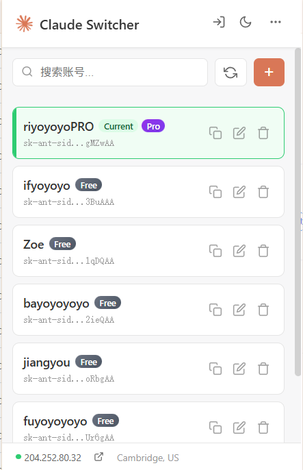

# Claude Session Switcher

[English](README.md) | **中文文档**

一个轻量、高效的 Chrome 扩展，用于在多个 [Claude.ai](https://claude.ai) 账号之间无缝切换。基于 **Manifest V3** 和原生 JavaScript 构建，拥有现代化的 UI 设计，并针对性能进行了深度优化。

## ✨ 功能特性

* **⚡ 一键切换**: 无需手动退出再登录，点击即可瞬间切换账号。
* **🏷️ 标签管理系统**: 
    * 创建自定义颜色标签来分类管理账号。
    * **标签筛选栏**: 一键按标签筛选账号。
    * **独立标签排序**: 每个标签视图维护独立的拖拽排序顺序。
    * **"无标签"筛选**: 快速查找没有任何标签的账号。
* **🚀 极致性能**:
    * **防抖搜索**: 搜索框输入更加流畅，无卡顿。
    * **O(1) 极速查重**: 即使有数百个账号，添加或导入时也能瞬间完成查重。
    * **0 CPU 待机**: 采用事件驱动架构，不使用时完全不占用资源。
* **🚪 快速重新登录**: 快捷清除当前会话并跳转至登录页，方便添加新账号。
* **🎨 现代化 UI**: 
    * 采用卡片式设计，配备 SVG 图标和响应式布局。
    * 支持**深色模式**。
    * **自定义删除确认弹窗**: 精美对话框取代原生浏览器提示。
    * **ESC 快捷键**: 按 ESC 关闭任意弹窗。
* **📥 智能自动获取**: 
    * 自动从当前标签页抓取 `sessionKey`。
    * **智能用户名与套餐提取**: 利用 DOM 技术直接从 Claude 侧边栏读取并填入您的用户名和订阅套餐。
* **🏷️ 套餐徽章**: 在账号卡片上显示可视化套餐标识（Pro/Team/Free）。
* **🔄 快速同步**: 工具栏一键更新当前账号的用户名和套餐信息。
* **🌍 网络监控**: 
    * 底部状态栏实时显示当前 **IP** 和 **地理位置**。
    * **一键体检**: 专用按钮跳转至外部服务，评估当前 IP 的风险指数。
* **🖱️ 拖拽排序**: 长按并拖动即可调整账号列表顺序。
* **💾 导入与导出**: 支持将账号列表备份为 JSON 文件，或导入到其他设备。
* **🔒 安全本地化**: 
    * 所有 Key 仅存储在浏览器的 `chrome.storage.local` 中。
    * 绝不上传至任何远程服务器。

## 📸 预览

## 📦 安装指南

1. 从 [Releases](https://github.com/kieranchan/Claude-Session-Switcher/releases) 下载最新版本
2. 解压 ZIP 文件到一个文件夹
3. 打开 Chrome 浏览器并访问 `chrome://extensions/`
4. 打开右上角的 **开发者模式** 开关
5. 点击 **加载已解压的扩展程序** 并选择解压后的文件夹
6. 完成！点击工具栏中的扩展图标即可使用

## 📖 使用说明

### 添加账号
1. 点击工具栏中的 **+** 按钮。
2. **自动方式**: 确保您已在 Claude.ai 登录，点击 **📥 按钮** 自动填入 Session Key 和用户名。
3. **手动方式**: 手动粘贴 `sk-ant...` 开头的 Key。
4. 可选择标签来分类管理账号。
5. 点击 **保存**。

### 切换账号
点击列表中的任意 **账号卡片**，插件会自动替换 Cookie 并刷新 Claude 页面，立即生效。

### 标签管理
* 点击工具栏中的 **标签图标** 打开标签管理器。
* 创建、编辑或删除带颜色的标签。
* 使用工具栏下方的 **标签筛选栏** 按标签筛选账号。

### 网络与安全
* **查看 IP**: 关注底部状态栏的信息。
* **安全报告**: 点击 IP 旁边的 **🔗** 图标，查看 IP 风险报告。

## ⚠️ 安全声明

* **仅限本地**: 您的数据永远不会离开您的浏览器。
* **权限说明**: 
    * `cookies`: 用于修改 Cookie 实现账号切换。
    * `scripting`: 用于从页面 DOM 中读取用户名。
    * `storage`: 用于保存账号列表。

## 📄 许可证

本项目基于 MIT 许可证开源 - 详情请参阅 [LICENSE](LICENSE) 文件。